 <aside>
💡 아래 명세를 잘 읽어보고, 서버를 구현합니다.

</aside>

## Description

- **`콘서트 예약 서비스`**를 구현해 봅니다.
- 대기열 시스템을 구축하고, 예약 서비스는 작업가능한 유저만 수행할 수 있도록 해야합니다.
- 사용자는 좌석예약 시에 미리 충전한 잔액을 이용합니다.
- 좌석 예약 요청시에, 결제가 이루어지지 않더라도 일정 시간동안 다른 유저가 해당 좌석에 접근할 수 없도록 합니다.

## Requirements

- 아래 5가지 API 를 구현합니다.
    - 유저 토큰 발급 API
    - 예약 가능 날짜 / 좌석 API
    - 좌석 예약 요청 API
    - 잔액 충전 / 조회 API
    - 결제 API
- 각 기능 및 제약사항에 대해 단위 테스트를 반드시 하나 이상 작성하도록 합니다.
- 다수의 인스턴스로 어플리케이션이 동작하더라도 기능에 문제가 없도록 작성하도록 합니다.
- 동시성 이슈를 고려하여 구현합니다.
- 대기열 개념을 고려해 구현합니다.

## API Specs

1️⃣ **`주요` 유저 대기열 토큰 기능**

- 서비스를 이용할 토큰을 발급받는 API를 작성합니다.
- 토큰은 유저의 UUID 와 해당 유저의 대기열을 관리할 수 있는 정보 ( 대기 순서 or 잔여 시간 등 ) 를 포함합니다.
- 이후 대기열에 의해 **보호받는** 모든 API 는 위 토큰을 이용해 대기열 검증을 통과해야 이용 가능합니다.
- **내 대기번호를 조회하는 폴링용 API를 작성합니다.**

> 기본적으로 폴링으로 본인의 대기열을 확인한다고 가정하며, 다른 방안 또한 고려해보고 구현해 볼 수 있습니다.
> 

**2️⃣ `기본` 예약 가능 날짜 / 좌석 API**

- 예약가능한 날짜와 해당 날짜의 좌석을 조회하는 API 를 각각 작성합니다.
- 예약 가능한 날짜 목록을 조회할 수 있습니다.
- 날짜 정보를 입력받아 예약가능한 좌석정보를 조회할 수 있습니다.

> 좌석 정보는 1 ~ 50 까지의 좌석번호로 관리됩니다.
> 

3️⃣ **`주요` 좌석 예약 요청 API**

- 좌석 예약과 동시에 해당 좌석은 그 유저에게 약 5분간 임시 배정됩니다. ( 시간은 정책에 따라 자율적으로 정의합니다. )
- 날짜와 좌석 정보를 입력받아 좌석을 예약 처리하는 API 를 작성합니다.
- 만약 배정 시간 내에 결제가 완료되지 않는다면 좌석에 대한 임시 배정은 해제되어야 하며 임시배정 상태의 좌석에 대해 다른 사용자는 예약할 수 없어야 한다.

4️⃣ **`기본`**  **잔액 충전 / 조회 API**

- 결제에 사용될 금액을 API 를 통해 충전하는 API 를 작성합니다.
- 사용자 식별자 및 충전할 금액을 받아 잔액을 충전합니다.
- 사용자 식별자를 통해 해당 사용자의 잔액을 조회합니다.

5️⃣ **`주요` 결제 API**

- 결제 처리하고 결제 내역을 생성하는 API 를 작성합니다.
- 결제가 완료되면 해당 좌석의 소유권을 유저에게 배정하고 대기열 토큰을 만료시킵니다.

<aside>
💡 **KEY POINT**

</aside>

- 유저간 대기열을 요청 순서대로 정확하게 제공할 방법을 고민해 봅니다.
- 동시에 여러 사용자가 예약 요청을 했을 때, 좌석이 중복으로 배정 가능하지 않도록 합니다.

<aside>
🗓️ **Weekly Schedule Summary: 이번 챕터의 주간 일정 (금요일 오전 10시까지 제출)**

</aside>

### 4주차 과제

### **`DEFAULT`**

- 각 시나리오별 하기 **비즈니스 로직** 개발 및 **단위 테스트** 작성
    - `e-commerce` : 상품 조회, 주문/결제 기능
    - `concert` : 대기열 발급, 대기순번 조회, 좌석 예약 기능

> **단위 테스트** 는 반드시 대상 객체/기능 에 대한 의존성만 존재해야 함
> 

### **`STEP07`**

- API Swagger 기능 구현 및 캡쳐본 첨부 ( Readme )
- 주요 비즈니스 로직 개발 및 단위 테스트 작성

### **`STEP08`**

- 비즈니스 Usecase 개발 및 통합 테스트 작성

> API 의 완성이 목표가 아닌, 기본 및 주요 기능의 비즈니스 로직 및 유즈케이스는 구현이 완료 되어야 함. ( `Business Layer` )
> 

> DB Index , 대용량 처리를 위한 개선 포인트 등은 추후 챕터에서 진행하므로 목표는 `기능 개발의 완료` 로 합니다. 최적화 작업 등을 고려하는 것 보다 모든 기능을 정상적으로 제공할 수 있도록 해주세요. 특정 기능을 왜 이렇게 개발하였는지 합당한 이유와 함께 기능 개발을 진행해주시면 됩니다.
>

## 단위테스트, 통합테스트, POSTMAN 테스트 결과

### Queue

#### UnitTest
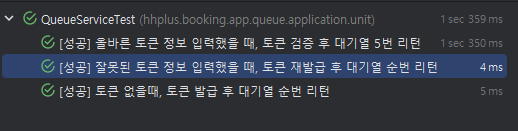

#### IntegrationTest

대기열 동시성 통합 테스트

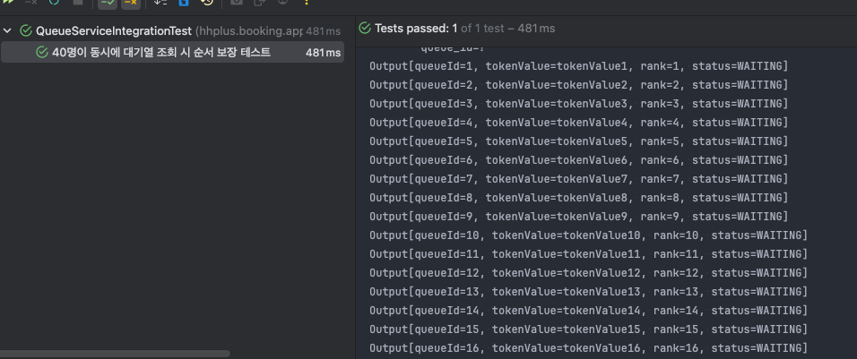

#### PostManTest

대기열 순번조회

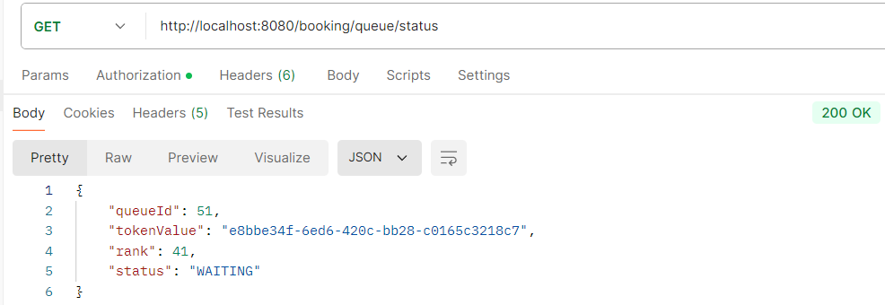

### Concert

#### UnitTest
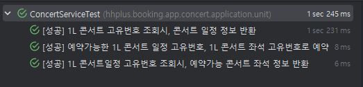

#### IntegrationTest

콘서트 예약 동시성 통합테스트

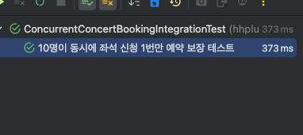

#### PostManTest

콘서트 일정 조회

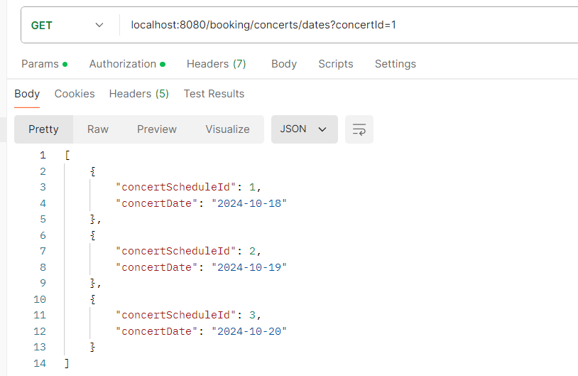

콘서트 좌석조회

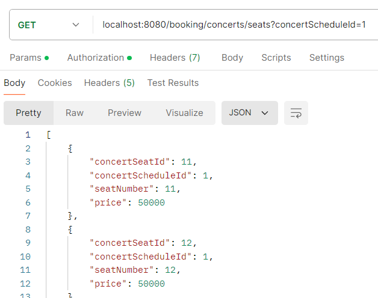

콘서트 예약

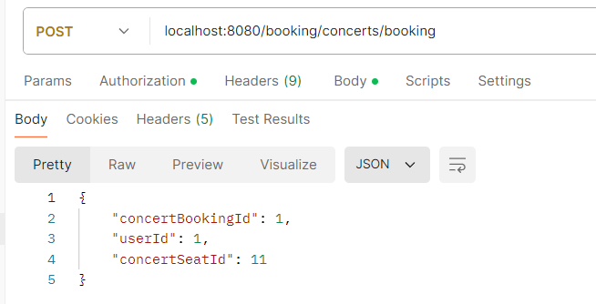

### User

#### UnitTest

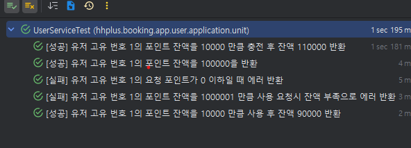

#### PostManTest

유저 포인트 조회

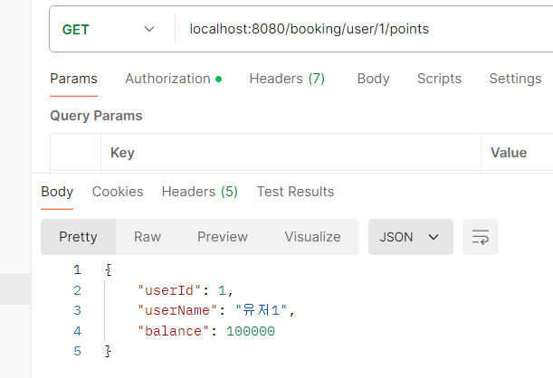

유저 포인트 충전

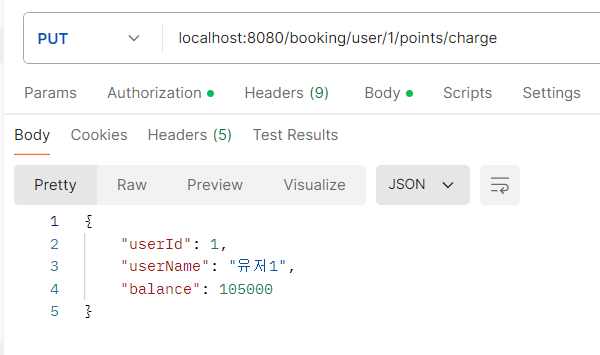

유저 포인트 사용

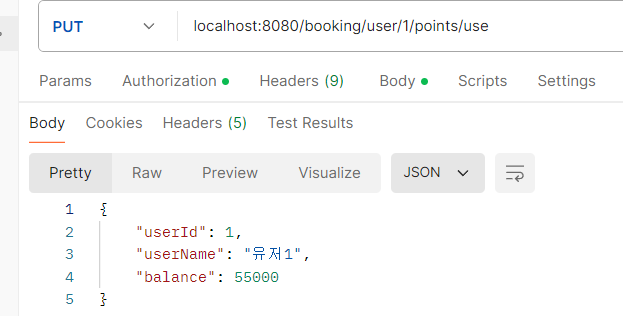

### Payment

#### IntegrationTest

결제 통합 테스트

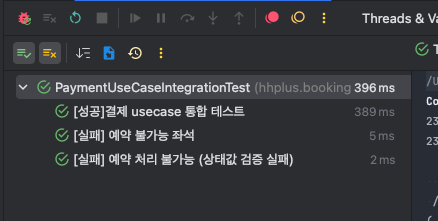

#### PostmanTest

결제 테스트

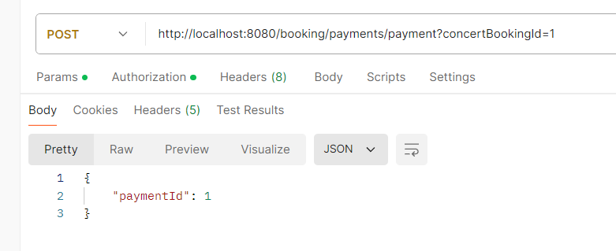
