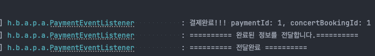

 <aside>
💡 아래 명세를 잘 읽어보고, 서버를 구현합니다.

</aside>

## Description

- **`콘서트 예약 서비스`**를 구현해 봅니다.
- 대기열 시스템을 구축하고, 예약 서비스는 작업가능한 유저만 수행할 수 있도록 해야합니다.
- 사용자는 좌석예약 시에 미리 충전한 잔액을 이용합니다.
- 좌석 예약 요청시에, 결제가 이루어지지 않더라도 일정 시간동안 다른 유저가 해당 좌석에 접근할 수 없도록 합니다.

<aside>
🗓️ **Weekly Schedule Summary: 이번 챕터의 주간 일정 (금요일 오전 10시까지 제출)**

</aside>

### 8주차 과제

### **`STEP 15_기본`**

- 나의 시나리오에서 수행하는 쿼리들을 수집해보고, 필요하다고 판단되는 인덱스를 추가하고 쿼리의 성능개선 정도를 작성하여 제출
    - 자주 조회하는 쿼리, 복잡한 쿼리 파악
    - Index 추가 전후 Explain, 실행시간 등 비교

### **`STEP 16_심화`**

- 내가 개발한 기능의 트랜잭션 범위에 대해 이해하고, 서비스의 규모가 확장된다면 서비스들을 어떻게 분리하고 그 분리에 따른 트랜잭션 처리의 한계와 해결방안에 대한 서비스설계 문서 작성
- 실시간 주문, 좌석예약 정보를 데이터 플랫폼에 전달하거나 이력 데이터를 저장 ( 외부 API 호출, 메세지 발행 등 ) 하는 요구사항 등을 기존 로직에 추가해 보고 기존 로직에 영향 없이 부가 기능을 제공

# STEP 15

## DB (MySQL) & 인덱싱

https://velog.io/@saruru/123

# STEP 16
## 트랜잭션 범위 이해 & 트랜잭션 분리 및 해결방안

### 개발방식의 변화와 트랜잭션 범위에 대한 고민의 필요성 대두
트랜잭션 범위와 확장성에 대해 생각해보면, 작은 서비스일 때는 단일 트랜잭션 안에서 모든 처리를 끝낼 수 있어서 설계가 비교적 단순하다. 
하지만 서비스 규모가 커지고 분산 환경으로 확장되면, 트랜잭션 처리의 일관성과 안정성을 유지하는 게 더 어려워진다. 
특히, 여러 서비스가 함께 작동해야 하는 경우엔 개별 서비스의 트랜잭션 처리 방식에 대한 깊은 이해가 필요하다.

기존 전통적인 개발 방식이였던 모놀리식 아키텍처는 단일 애플리케이션으로 모든 기능을 포함하고 있어 개발 및 배포 초기에는 관리가 단순하고 일관성을 유지하기 좋다. 
그러나 규모가 커질수록 단일 코드베이스가 비대해져 수정 및 배포 시 복잡성이 크게 증가하고, 성능상의 한계와 장애 대응이 어려워진다.
특히 여러 팀이 동시에 작업할 때 코드 간의 충돌이 빈번해지고, 작은 변경 사항에도 전체 애플리케이션을 다시 배포해야 하는 비효율이 발생한다.

이런 한계로 인해 **마이크로서비스 아키텍처(MSA)**가 등장했다. 
MSA는 서비스별로 독립적으로 개발 및 배포할 수 있도록 구성하여, 기능을 각각의 모듈로 분리한다. 
이로 인해 서비스마다 독립적으로 운영되며, 확장성, 유연성, 장애 격리에서 모놀리식에 비해 유리하다.


### MSA와 모놀리식 아키텍처 비교

| 특징               | MSA (Microservices Architecture)                                              | 모놀리식 아키텍처 (Monolithic Architecture)                        |
|--------------------|------------------------------------------------------------------------------|-------------------------------------------------------------------|
| **구성 방식**      | 기능별로 독립된 여러 서비스로 구성                                             | 하나의 큰 애플리케이션으로 구성                                      |
| **개발 및 배포**   | 개별 서비스 단위로 독립적으로 개발 및 배포 가능                                  | 전체 시스템을 하나의 배포 단위로 묶어 배포해야 함                       |
| **확장성**         | 특정 서비스만 개별적으로 확장 가능                                               | 전체 애플리케이션을 함께 확장해야 하므로 비효율적                       |
| **유지보수**       | 각 서비스가 독립적이라 일부 변경이 다른 서비스에 미치는 영향이 적음                   | 변경 시 전체 애플리케이션의 영향 범위가 큼                             |
| **기술 스택**      | 서비스마다 다른 기술 스택 사용 가능                                              | 일관된 기술 스택을 사용해야 함                                       |
| **데이터 저장소**  | 서비스마다 개별 데이터 저장소를 가질 수 있음                                      | 단일 데이터베이스를 사용하는 경우가 많음                               |
| **장애 격리**      | 특정 서비스 장애 시 다른 서비스는 영향 없이 운영 가능                              | 한 부분의 장애가 전체 시스템으로 확산될 가능성이 큼                     |
| **의존성 관리**    | 서비스 간의 API로 통신하므로 느슨한 결합 가능                                    | 코드 레벨에서 모듈 간 의존성이 높음                                  |
| **복잡도**         | 서비스 분리가 이루어지면 각 서비스가 단순해지지만 전체 시스템 관리가 복잡해질 수 있음 | 코드가 한 곳에 있어 관리가 단순하지만 애플리케이션 자체는 복잡해질 수 있음 |
| **성능**           | 네트워크 통신이 필요해 오버헤드 발생 가능                                         | 내부 호출로 상대적으로 빠른 성능                                      |


#### MSA에서 트랜잭션 범위 이해 및 트랜잭션 분리의 필요성
MSA로 전환하면서 각 서비스가 독립적으로 동작하게 되므로, 분산된 여러 서비스가 함께 데이터를 처리할 때 트랜잭션 관리가 복잡해진다. 
모놀리식에서는 하나의 트랜잭션 범위 내에서 모든 처리를 일관성 있게 유지할 수 있었지만, MSA에서는 하나의 서비스에서 트랜잭션을 종료한 후 다른 서비스로 데이터를 넘겨야 하므로 강한 일관성을 유지하기 어렵다. 
이 때문에 각 서비스의 트랜잭션을 별도로 관리하면서도 전체 흐름의 일관성을 유지할 방법이 필요하다.

#### 트랜잭션 관리와 해결 방안
서비스를 분리한다는 것은 기본적으로 서비스마다 고유한 트랜잭션 관리가 필요하다는 것을 의미한다. 
각 서비스가 독립적으로 트랜잭션을 관리하게 되면서 기존의 강한 일관성 보다는 최종적 일관성을 지향하는 패턴이 유용할 수 있다. 
MSA 환경에서는 SAGA 패턴이나 아웃박스패턴, 이벤트 기반의 아키텍처 등으로 처리가 가능하다.

## SAGA 패턴

### 정의
SAGA 패턴은 **분산 트랜잭션을 관리하기 위한 패턴**으로, 각 서비스가 트랜잭션의 독립적인 단위로서 동작하도록 한다. 각 서비스는 독립적으로 트랜잭션을 수행하며, 전체 트랜잭션의 일관성은 각 서비스가 순차적으로 성공해야 유지된다. 트랜잭션 단계에서 오류가 발생하면 보상 트랜잭션을 실행해 이전 상태로 복구한다.

### 장점
- **독립성**: 각 서비스가 자체 트랜잭션을 관리해 서비스 간 결합도가 낮음.
- **유연한 복구**: 오류 시 보상 트랜잭션으로 시스템을 쉽게 복구 가능.
- **최종 일관성 유지**: 분산 시스템 환경에서 최종 일관성을 제공하여 확장성에 유리.

### 단점
- **복잡성 증가**: 서비스와 보상 트랜잭션 간의 관리 로직이 복잡해짐.
- **성능 이슈**: 트랜잭션 단계마다 순차적으로 실행되므로 지연 시간이 발생할 수 있음.
- **추적 어려움**: 트랜잭션 상태를 추적하기 어려워 로깅과 모니터링이 필수.

---

## OUTBOX 패턴

### 정의
아웃박스(Outbox) 패턴은 **트랜잭션 일관성을 유지하면서 비동기 이벤트를 외부에 전달**하기 위한 패턴이다. 아웃박스 테이블에 이벤트를 저장하고, 이후에 이를 읽어 이벤트 버스로 전달한다. 아웃박스 테이블과 주요 데이터는 하나의 트랜잭션에서 처리되므로, 데이터베이스 일관성을 보장할 수 있다.

### 장점
- **데이터 일관성 보장**: 데이터와 이벤트가 함께 트랜잭션으로 처리되어 일관성 유지.
- **유실 방지**: 아웃박스 테이블에 기록된 이벤트를 재시도할 수 있어 신뢰성 향상.
- **외부 시스템과의 안전한 통합**: 외부 서비스와의 비동기 통신을 안전하게 수행 가능.

### 단점
- **관리 복잡성**: 아웃박스 테이블 관리 및 정리가 필요해 관리 복잡성 증가.
- **성능 저하**: 트랜잭션 내 데이터 저장과 이벤트 기록이 동시에 이루어져 성능에 영향을 줄 수 있음.

---

## 이벤트 기반 아키텍처

### 정의
이벤트 기반 아키텍처는 **Spring의 ApplicationEventPublisher와 @EventListener를 활용하여 이벤트를 발생시키고 이를 수신**하여 처리하는 방식이다. 이를 통해 비동기 작업을 처리하며, 각 모듈 간 결합도를 낮추어 독립성을 유지할 수 있다.

### 특징 및 장점
- **비동기 처리**: 이벤트 발행 후 리스너에서 비동기로 작업을 처리하여 성능 최적화.
- **모듈 간 결합도 감소**: 이벤트 발행자와 리스너 간 결합도가 낮아 유지보수와 확장이 용이.
- **유연성**: 새로운 기능 추가 시 리스너를 추가하는 방식으로 손쉽게 기능 확장이 가능.

### 한계점
- **트랜잭션 관리 복잡성**: 이벤트가 비동기로 처리되므로 트랜잭션 일관성을 유지하기 어려울 수 있음.
- **추적 어려움**: 이벤트가 여러 리스너로 분산되기 때문에 상태 추적과 모니터링이 필수적임.

이번주차에서는 이벤트 기반의 아키텍처를 통한 트랜잭션 분리를 실습해보려 한다.

### 이벤트 기반 아키텍처 구현

먼저 현재 나의 프로젝트에서는 결제 usecase 를 보자면

1. concertBooking 조회
2. concertSeat 조회 및 예약된 좌석인지 조회
3. user 결제 포인트 조회 및 사용
4. 대기열삭제

등의 구조로 이루어져 있다.
이 네개의 과정이 모놀리식 이라면, 하나의 트랜잭션에 묶여 처리 된 후 완료 되겠지만,
각각 MSA 라고 가정하면 1 -> 2-> 3-> 4 의 과정을 넘어 가며 각각 정보를 전달하여 진행이 될 것이다.
현재 구조에서는 모든 트랜잭션이 끝나고, 완료 되었다는 히스토리를 외부로 전달 해 주는 실습을 해볼 수 있을 것같다.

```java
@Transactional
public PaymentInfo.Output processPayment(PaymentInfo.Input input) {

    ConcertBooking concertBooking = concertRepository.getConcertBooking(input.concertBookingId());
    concertBooking.validConcertBookingStatus();

    ConcertSeat concertSeat = concertRepository.getConcertSeat(concertBooking.getConcertSeatId());
    User user = userRepository.findUserWithLockById(concertBooking.getUserId());

    user.usePoints(concertSeat.getPrice());

    Payment payment = paymentRepository.savePayment(concertBooking.getConcertBookingId(), concertSeat.getPrice());
    concertBooking.updateBookingStatusToCompleted();
    queueRepository.deleteProcessingToken(input.authorizationHeader().substring(7));
    paymentEventPublisher.success(new PaymentSuccessEvent(payment.getPaymentId(), payment.getConcertBookingId()));

    return new PaymentInfo.Output(payment.getPaymentId());
}

```
기존 결제로직에서, 모두 완료시 이벤트를 발행시키는 로직을 추가한다.

```java
package hhplus.booking.app.payment.application;

import lombok.RequiredArgsConstructor;
import org.springframework.context.ApplicationEventPublisher;
import org.springframework.stereotype.Component;

@Component
@RequiredArgsConstructor
public class PaymentEventPublisher {
    private final ApplicationEventPublisher applicationEventPublisher;

    public void success(PaymentSuccessEvent event) {
        applicationEventPublisher.publishEvent(event);
    }
}

```
성공시 이벤트를 발행 하도록 추가한다.

```java
package hhplus.booking.app.payment.application;

import lombok.RequiredArgsConstructor;
import lombok.extern.slf4j.Slf4j;
import org.springframework.scheduling.annotation.Async;
import org.springframework.stereotype.Component;
import org.springframework.transaction.event.TransactionPhase;
import org.springframework.transaction.event.TransactionalEventListener;

@Slf4j
@Component
@RequiredArgsConstructor
public class PaymentEventListener {

    @Async
    @TransactionalEventListener(phase = TransactionPhase.AFTER_COMMIT)
    public void paymentSuccessHandler(PaymentSuccessEvent paymentSuccessevent) {
        log.info("결제완료!!! paymentId: {}, concertBookingId: {}", paymentSuccessevent.paymentId(), paymentSuccessevent.concertBookingId());
        log.info("========== 완료된 정보를 전달합니다.==========");
        log.info("========== 전달완료 ==========");
    }
}

```
이벤트가 발행되면, 리스너가 그를 감지하고 커밋이후에 완료 되었다는 정보를 넘기게 된다.


