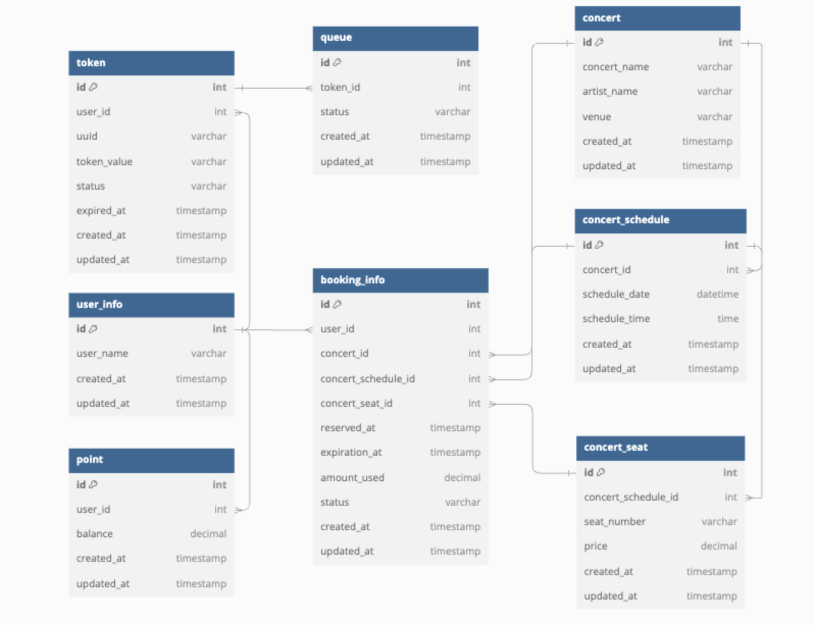

```
Table user_info {
  id int [pk, increment]
  user_name varchar
  created_at timestamp
  updated_at timestamp
}

Table token {
  id int [pk, increment]
  user_id int [ref: > user_info.id]
  uuid varchar
  token_value varchar
  status varchar
  expired_at timestamp
  created_at timestamp
  updated_at timestamp
}

Table queue {
  id int [pk, increment]
  token_id int [ref: > token.id]
  
  status varchar   
  created_at timestamp
  updated_at timestamp
}

Table concert {
  id int [pk, increment]
  concert_name varchar
  artist_name varchar
  venue varchar
  created_at timestamp
  updated_at timestamp
}

Table concert_schedule {
  id int [pk, increment]
  concert_id int [ref: > concert.id]
  schedule_date datetime
  schedule_time time
  created_at timestamp
  updated_at timestamp
}

Table concert_seat {
  id int [pk, increment]
  concert_schedule_id int [ref: > concert_schedule.id]
  seat_number varchar
  price decimal
  created_at timestamp
  updated_at timestamp
}

Table reservation {
  id int [pk, increment]
  user_id int [ref: > user_info.id]
  concert_id int [ref: > concert.id]
  concert_schedule_id int [ref: > concert_schedule.id]
  concert_seat_id int [ref: > concert_seat.id]
  reserved_at timestamp
  expiration_at timestamp
  amount_used decimal
  status varchar
  created_at timestamp
  updated_at timestamp
}

Table point {
  id int [pk, increment]
  user_id int [ref: > user_info.id]
  balance decimal
  created_at timestamp
  updated_at timestamp
}


```