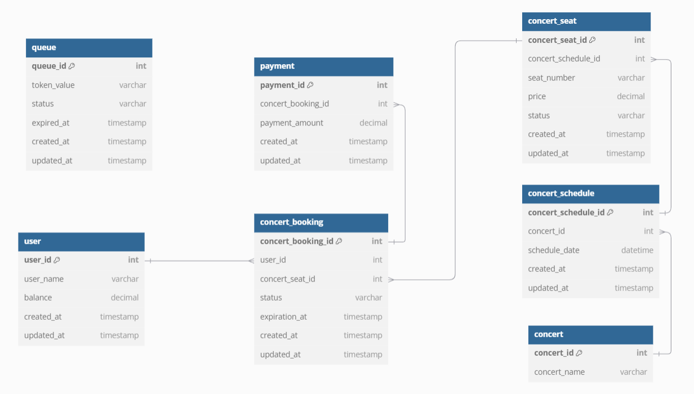

```

https://dbdiagram.io/d

Table user {
  user_id int [pk, increment]
  user_name varchar
  balance decimal
  created_at timestamp
  updated_at timestamp
}

Table queue {
  queue_id int [pk, increment]
  token_value varchar
  status varchar
  expired_at timestamp
  created_at timestamp
  updated_at timestamp
}

Table concert {
  concert_id int [pk, increment]
  concert_name varchar
}

Table concert_schedule {
  concert_schedule_id int [pk, increment]
  concert_id int [ref: > concert.concert_id]
  schedule_date datetime
  created_at timestamp
  updated_at timestamp
}

Table concert_seat {
  concert_seat_id int [pk, increment]
  concert_schedule_id int [ref: > concert_schedule.concert_schedule_id]
  seat_number varchar
  price decimal
  status varchar
  created_at timestamp
  updated_at timestamp
}

Table concert_booking {
  concert_booking_id int [pk, increment]
  user_id int [ref: > user.user_id]
  concert_seat_id int [ref: > concert_seat.concert_seat_id]
  status varchar
  expiration_at timestamp
  created_at timestamp
  updated_at timestamp
}

Table payment {
  payment_id int [pk, increment]
  concert_booking_id int [ref: > concert_booking.concert_booking_id]
  payment_amount decimal
  created_at timestamp
  updated_at timestamp
}

```