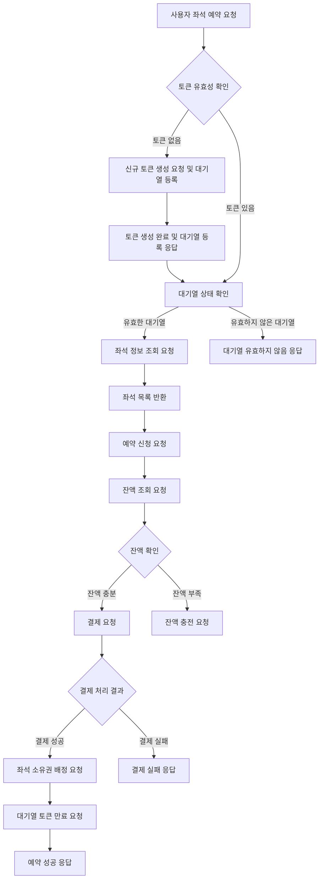

### 플로우차트

```mermaid
flowchart TD
    A[사용자 좌석 예약 요청] --> B{토큰 유효성 확인}
    B -->|토큰 없음| C[신규 토큰 생성 요청 및 대기열 등록]
    C --> D[토큰 생성 완료 및 대기열 등록 응답]
    D --> G[대기열 상태 확인]

    B -->|토큰 있음| G[대기열 상태 확인]

    G -->|유효한 대기열| H[좌석 정보 조회 요청]
    H --> I[좌석 목록 반환]
    
    G -->|유효하지 않은 대기열| J[대기열 유효하지 않음 응답]

    I --> K[예약 신청 요청]
    K --> L[잔액 조회 요청]
    L --> M{잔액 확인}
    M -->|잔액 충분| N[결제 요청]
    M -->|잔액 부족| O[잔액 충전 요청]
    
    N --> P{결제 처리 결과}
    P -->|결제 성공| Q[좌석 소유권 배정 요청]
    P -->|결제 실패| R[결제 실패 응답]
    
    Q --> S[대기열 토큰 만료 요청]
    S --> T[예약 성공 응답]
```
