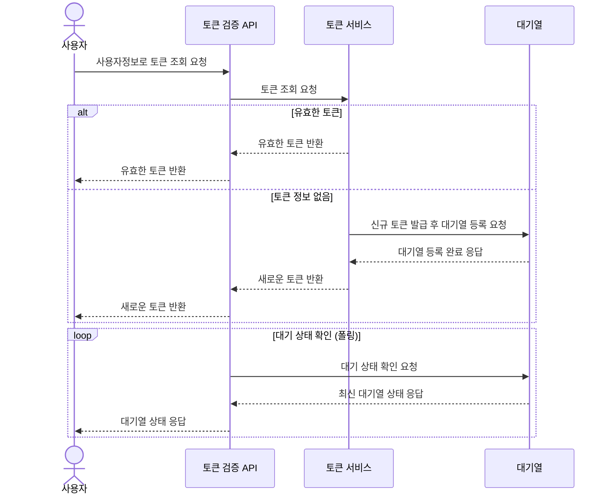
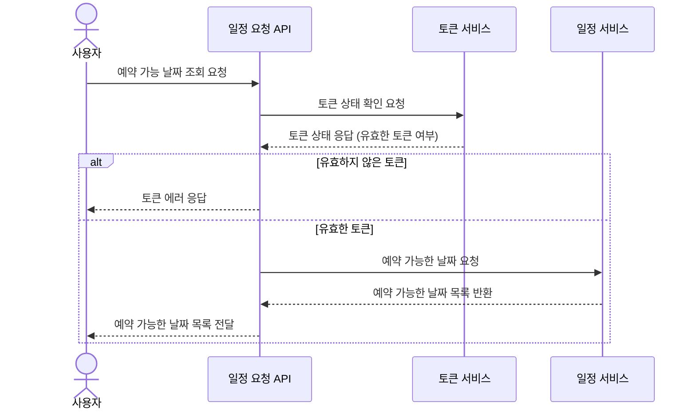
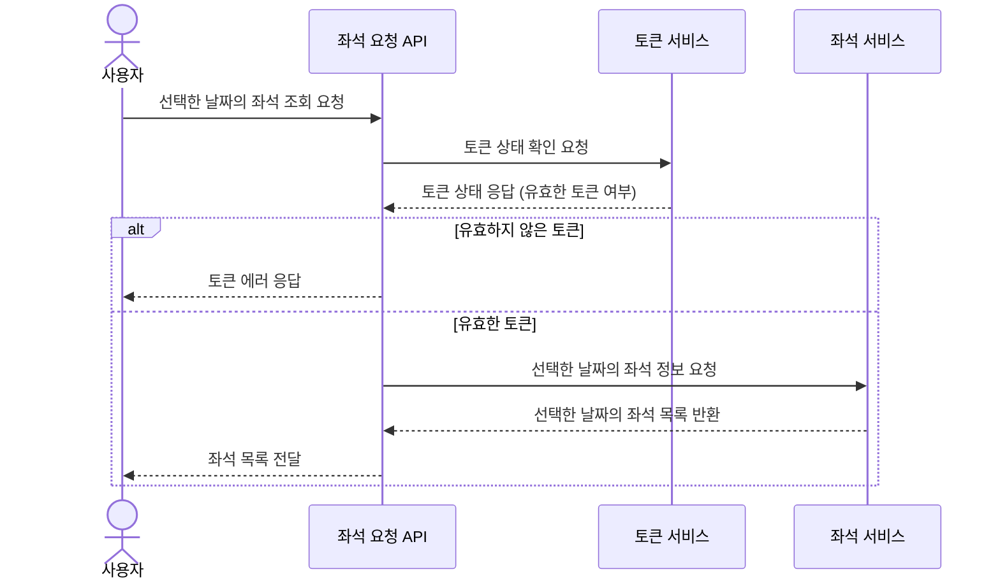
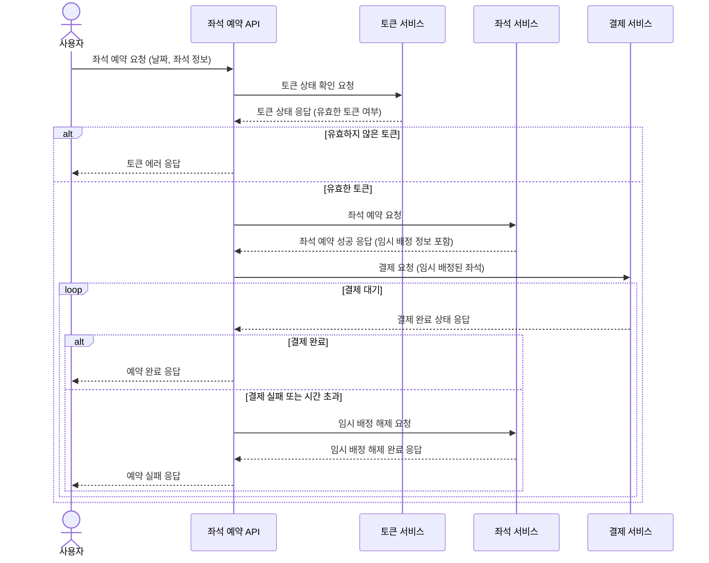
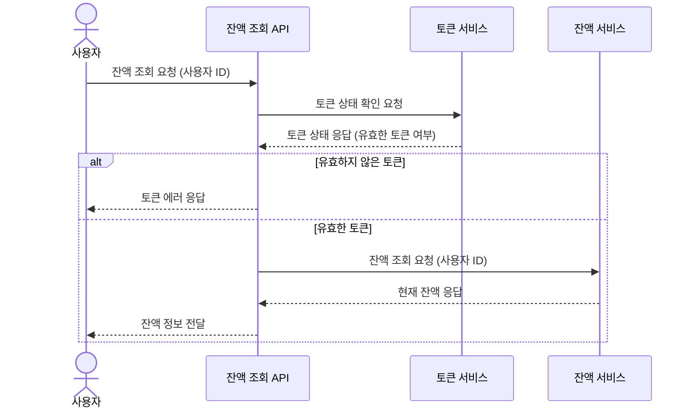
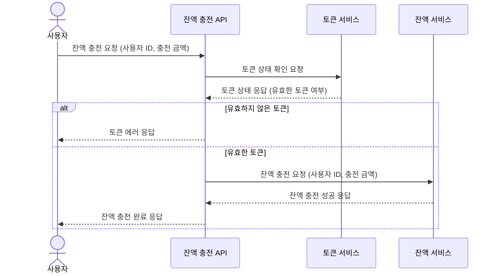
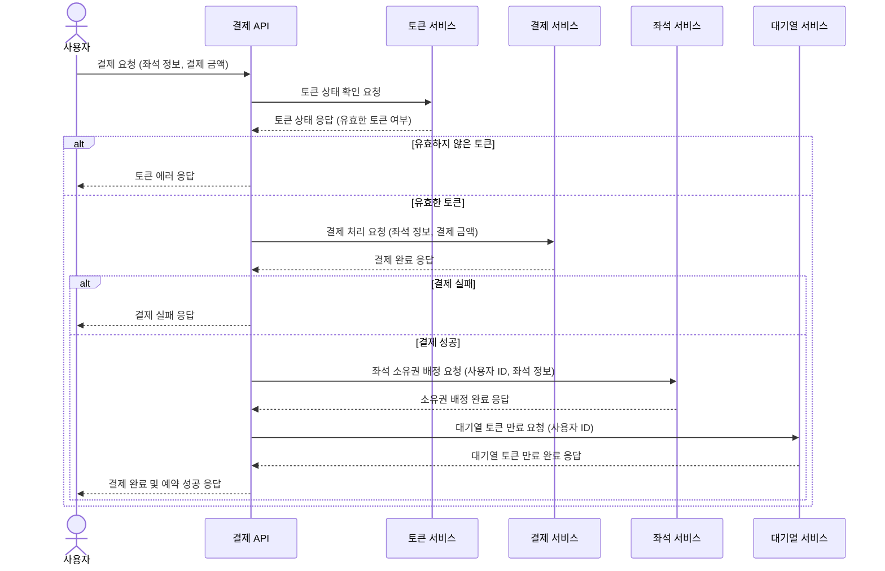

### 시퀀스 다이어그램

##### 1 토큰 검증 및 토큰 발급 후 대기열 등록

1️⃣ 주요 유저 대기열 토큰 기능

2️⃣**`기본` 예약 가능 날짜 / 좌석 API**

##### 2-1 콘서트 일정 조회

##### 2-2 콘서트 좌석 조회

3️⃣주요 좌석 예약 요청 API

##### 3 콘서트 예약 신청 및 임시예약

4️⃣기본 잔액 충전 / 조회 API
##### 4-1 포인트 잔액 조회

##### 4-2 포인트 충전

5️⃣주요 결제 API
##### 5 포인트를 사용한 결제 및 대기열 삭제

